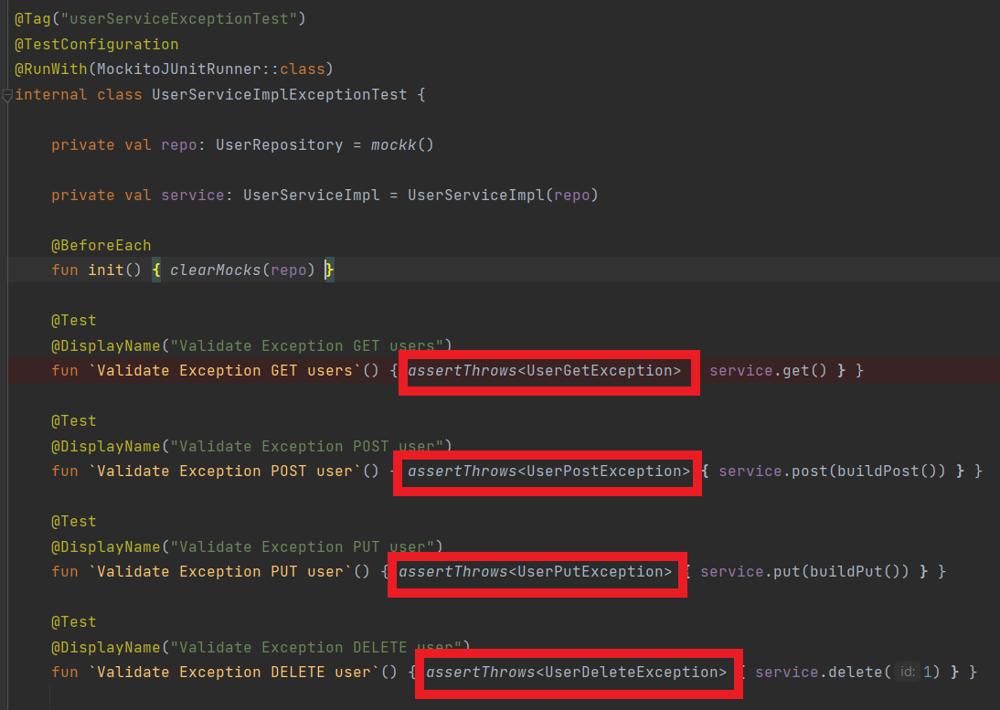

<h1 align="center">
    <a>🚀 CleanArchitecture</a>
</h1>

Microservico Template com Clean Architecture

* [Sobre](#Sobre)

* [Documentação](#Documentação)

* [Grooming](#Grooming)
  * [Sistema](#sistema)
  * [Premissas](#premissas)  
  * [Cenários](#premissas)  

    
* [Principais Fluxos](#principais-fluxos)
  * [Criando Usuario](#criando-usuario)
  * [Buscando Usuario](#buscando-usuario)
  * [Alterando Usuario](#alterando-usuario)
  * [Deletando Usuario](#deletando-usuario)

* [Entradas](#entradas)
  * [HTTP](#http)
  * [Fila](#fila)
  

* [Banco de Dados](#banco-de-dados)
  * [Diagram](#diagram)
  * [Scripts](#scripts)
  

* [Testes](#testes)
  * [Unitários](#unitario)
    * [Lógica](#unit-logica)
    * [Exceção](#unit-exceção)
    * [Stratégias](#unit-stratégias)
    
  * [Integrado](#integrado)
    * [Lógica](#integrate-logica)
    * [Exceção](#integrate-exceção)
    * [Stratégias](#integrate-stratégias)
    

* [Tecnologias](#tecnologias)
  * [Kotlin](#kotlin)
  * [Spring Boot](#spring-boot)
  * [Spring Data](#spring-data)
  * [Spring Security](#spring-data)
  * [Spring Actuator](#spring-data)
  * [Spring LDAP](#spring-ldap)
  * [RabbitMQ](#rabbit-mq)
  * [JUnit](#junit)
  * [Mockito](#mockito)
  * [PostgreSQL](#postgre-sql)
  

* [Design Patter'n](#design-pattern)
  * [Clean Architecture](#clean-architecture)
  * [Strategy](#strategy)
  * [Builder](#builder)
  * [Server Driven UI](#server-driven-ui)
  * [Estrutura de Packages / Nomeclatura dos arquivos](#estrutura-de-packges)  
  * [Padrão de Logs](#padrão-de-logs)
  

* [Personas](#personas)

## Sobre

- Este é um template de microserviço com o padrão Clean Architecture;

- O intuito desse projeto é abordar os conteudos: Ecossistema Spring, Kotlin, Clean Architecture e outros Design Pattern's na prática

- Possui conexão com banco de dados. (PostgreSQL)

## Documentação

- http://localhost:8081/swagger-ui/index.html#/

## Grooming

- O termo se refere à preparação de backlog  (que são os requisitos ou lista de pendências) e é mais adequadamente conhecido como refinamento. É o ato de detalhar, entender mais profundamente, adicionar características, estimar, priorizar e manter o backlog do produto vivo.

#### Sistema

                    CleanArchitecture

    [Servidor]                   Spring Boot

    [Banco de dados]             Spring Data / PostgreSQL

    [Linguagem]                  Kotlin

    [Autenticação]               SpringSecurity / oAuth2 / JWT

    [Design Pattern's]           Clean Architecture / Strategy / Chain Of Responsability / Builder

    [Mensageria]                 Rabbit 

    [Documentação]               Swagger

##### Premissas

    Gerenciar dados do usuario;

    DataBase própria;

    Criação do usuario no LDAP;

    Notificação CRM pós criação;

##### Cenários

    1.Criar Usuario:
        1.1 Criar usuario na base PostgreSQL;
        1.2 Criar usuario no LDAP;
        1.3 Disparar notificação para o ADM;

    2.Buscar Usuario:
        2.1 Buscar todos usuarios;
        2.2 Buscar usuario por CPF;
        2.3 Buscar usuario por nome;

    3.Alterar dados usuario:
        3.1 Se usuario não estiver bloqueado:Alterar dados na base PostgreSQL
        3.2 Se usuario estiver bloqueado: Retornar exceção

    4. Bloquear / Desbloquear usuario: 

## Principais Fluxos

#### Criando usuario;

#### Alterando usuário;

#### Deletando usuário;

## Entradas

#### HTTP

    1. Criar usuario                    POST localhost:8080/v1/user        
    2. Buscar usuario                   GET  localhost:8080/v1/user
    3. Alterar dados usuario            PUT  localhost:8080/v1/user
    4. Bloquear / Desbloquear usuario   PUT  localhost:8080/v1/user

#### Fila

    INP: NotifyCreateUser.INP
    RoutingKey: NotifyCreateUser
    DeadLetter: NotifyCreateUser.BCK.INP
    Routingkey DeadLetter: NotifyCreateUserDL

## Banco de Dados

#### Diagram

https://dbdiagram.io/d/604fca9cfcdcb6230b244b20

#### Scripts

                    Create database users;			
			--DROP DATABASE users;
			
			grant all privileges on database users to postgres;	

			CREATE TABLE public.tb_type_user(
			id_type_user bigint PRIMARY KEY,
			name varchar(255),
			active boolean,
			dh_create timestamp,
			dh_update timestamp,
			dh_exclude timestamp);
			
			CREATE TABLE public.tb_user(
			id_user bigint PRIMARY KEY,
			name varchar(255),
			id_type_user bigint,
			cellphone varchar(255),
			email varchar(255),
			active boolean,
			blocked boolean,
			dh_create timestamp,
			dh_update timestamp,
			dh_exclude timestamp);

			CREATE TABLE public.tb_user_address(
			id_user_address bigint PRIMARY KEY,
			id_user bigint,
			cellphone varchar(255),
			country varchar(255),
			state varchar(255),
			city varchar(255),
			district varchar(255),
			street varchar(255),
			zip_code varchar(255),
			dh_create timestamp,
			dh_update timestamp,
			dh_exclude timestamp);

## Testes

#### Unitários

##### Lógica

##### Exceção

##### Stratégias

##### Links

- https://resources.jetbrains.com/storage/products/kotlinconf2018/slides/4_Best%20Practices%20for%20Unit%20Testing%20in%20Kotlin.pdf

- https://kotlinlang.org/docs/jvm-test-using-junit.html#what-s-next

- https://www.petrikainulainen.net/programming/testing/running-kotlin-tests-with-gradle/

#### Integrado

##### Lógica

##### Exceção

##### Stratégias

##### Links

- https://learning.postman.com/docs/writing-scripts/script-references/test-examples/

- https://learning.postman.com/docs/writing-scripts/test-scripts/

- https://learning.postman.com/docs/writing-scripts/intro-to-scripts/

## Tecnologias

#### Koltin

- Declarando funções

- Tratando exceção / sucesso

- Extension Function

#### Spring Boot

    O que é: Framework responsavel por construir o servidor de aplicação onde a REGRA DE NEGOCIO será executada
    
    Pra que serve:  Facilitar o processo de configuração e publicação de aplicações que utilizem o ecossistema Spring.
    
    Conceitos: Injeção de Depêndencias, Bean,
    
    Anotações:
    @SpringBootApplication ->
    @EnableWebMvc ->
    @ComponentScan(value = ["com.example"]) ->
    @EntityScan(basePackages = ["com.example"]) ->
    @EnableJpaRepositories(basePackages = ["com.example"]) ->
    @Configuration  ->
    @Bean ->
    
    Exemplos:
    
    Iago: Spring Boot é o framework (tecnologia) que permite construir um servidor de aplicação e
    injetar as dependencias necessárias para execução do serviço.
    
    Ele nos facilita na configuração do servidor, com ele, o desenvolvedor abstrai essa responsabilidade.
    
    Com a evolução do SpringBoot, permitiu-se a evolução da arquitetura de microservicos.
    
    Link:https://blog.geekhunter.com.br/tudo-o-que-voce-precisa-saber-sobre-o-spring-boot/

#### Spring Data

#### Spring Security

#### Spring Actuator

#### Spring LDAP

#### RabbitMQ

#### JUnit

#### Mockito

#### PostgreSQL
        Clean Architecture    

        Strategy              

        Builder               https://pt.wikipedia.org/wiki/Builder

        Swagger               https://medium.com/@raphaelbluteau/spring-boot-swagger-documentando-sua-api-automaticamente-27903293aeb6

## Design Patter'n

#### Clean Architecture

- https://blog.cleancoder.com/uncle-bob/2012/08/13/the-clean-architecture.html

#### Strategy

- https://en.wikipedia.org/wiki/Strategy_pattern

#### Builder

#### Server Driven UI

- https://vitor-ramos.medium.com/entendendo-o-server-driven-ui-adb469add630

#### Estrutura de Packages / Nomeclatura dos arquivos

            Entities:
              Domain:
                User -> Objeto pertinente a camada do banco;
                UserEntity -> Objeto para transacionar fora da camada de repositorio;

            DTO:
                RequestNotifieCreateUserEntity -> Objeto de request para integrações
                ResponseNotifieCreateUserEntity -> Objeto de retorno de request para integrações

            Enum:
                TypeUserEnum: -> Referencia de Enum;

            Exception:
                UserPostException: -> Classe de exceção;

        Repository:
            Repository:
                UserRepository -> Interface de comunicação com BD;
            Domain
                User -> Classe de referencia ao BD;
            Config
                DataBaseConfig -> Bean de configuração do BD

        Usecases:
            Service:
                UserService -> Interface;
                UserServiceImpl -> Implementação;          

        Web:
            Controller:
                UserController -> Camada responsável por receber as requisições;
            Config
                SwaggerConfig -> Bean responsavel pela config do Swagger

        GatewayRepository:
            LdapRepository:
                GatewayLdapRepository -> Interface de comunicação entre os módulos

            NotifyRepository:
                GatewayNotifyRepository -> Interface de comunicação entre os módulos

        Other'sRepositoies: ex: LDAP
            Gateway:
                GatewayLdapRepositoryImpl -> Implementação do acesso ao módulo do LDAP

            Service:
                LdapService -> Interface da camada de negócio
                LdapServiceImpl -> Impl da camada de negócio

            Client:
                LdapClient -> Client de integração com LDAP 

#### Padrão de Logs

        runCatching {
             LOG.info("START {} user: {} body {}", methodName/service?, cpf, body)

            service.execute();

        }.onFailure {
             LOG.error("ERROR {} user: {} statusCode: {} cause: {} message: {}", methodName/service?, cpf, statusCodeResponse, causeResponse, messageResponse)
            
            throw it

        }.onSucesss {
             LOG.info("END {} user: {}", methodName/service?, cpf)
        }

## Personas

- Robert Martin -> Clean Code && Clean Architecture

## Contact

- https://www.linkedin.com/in/iagomagalh%C3%A3es/

