<h1 align="center">
    <a>🚀 CleanArchitecture</a>
</h1>
<p align="center">Microservico Template com Clean Architecture</p>


# 🏁 Tópicos


* [Sobre](#Sobre)


* [Documentação](#Documentação)


* [Grooming](#Grooming)
  * [Sistema](#sistema)
  * [Premissas](#premissas)  
  * [Cenários](#premissas)  

    
* [Principais Fluxos](#principais-fluxos)
  * [Criando Usuario](#criando-usuario)
  * [Buscando Usuario](#buscando-usuario)
  * [Alterando Usuario](#alterando-usuario)
  * [Deletando Usuario](#deletando-usuario)


* [Entradas](#entradas)
  * [HTTP](#http)
  * [Fila](#fila)
  

* [Banco de Dados](#banco-de-dados)
  * [Diagram](#diagram)
  * [Scripts](#scripts)
  

* [Testes](#testes)
  * [Unitários](#unitario)
    * [Lógica](#unit-logica)
    * [Exceção](#unit-exceção)
    * [Stratégias](#unit-stratégias)
    
  * [Integrado](#integrado)
    * [Lógica](#integrate-logica)
    * [Exceção](#integrate-exceção)
    * [Stratégias](#integrate-stratégias)
    

* [Tecnologias](#tecnologias)
  * [Kotlin](#kotlin)
  * [Spring Boot](#spring-boot)
  * [Spring Data](#spring-data)
  * [Spring Security](#spring-data)
  * [Spring Feign](#spring-feign)
  * [Spring Actuator](#spring-data)
  * [Spring LDAP](#spring-ldap)
  * [RabbitMQ](#rabbit-mq)
  * [JUnit](#junit)
  * [Mockito](#mockito)
  * [PostgreSQL](#postgre-sql)
  

* [Design Patter'n](#design-pattern)
  * [Clean Architecture](#clean-architecture)
  * [Strategy](#strategy)
  * [Chain Of Responsability](#chain-of-responsability)
  * [Builder](#builder)
  * [Server Driven UI](#server-driven-ui)
  * [Estrutura de Packages / Nomeclatura dos arquivos](#estrutura-de-packges)  
  * [Padrão de Logs](#padrão-de-logs)
  * [Clean Code](#clean-code)
  * [SOLID](#solid)
  * [GitFlow](#git-flow)
  

* [Readme](#readme)
* [Personas](#personas)


## Sobre

- Este é um template de microserviço com o padrão Clean Architecture;


- O intuito desse projeto é abordar os conteudos: Ecossistema Spring, Kotlin, Clean Architecture e outros Design Pattern's na prática


- Possui conexão com banco de dados. (PostgreSQL)


## Documentação

### Swagger
- http://localhost:8081/swagger-ui/index.html#/

## Grooming


- O termo se refere à preparação de backlog  (que são os requisitos ou lista de pendências) e é mais adequadamente conhecido como refinamento. É o ato de detalhar, entender mais profundamente, adicionar características, estimar, priorizar e manter o backlog do produto vivo.

#### Sistema

                    CleanArchitecture

    [Servidor]                   Spring Boot

    [Banco de dados]             Spring Data / PostgreSQL

    [Linguagem]                  Kotlin

    [Autenticação]               SpringSecurity / oAuth2 / JWT

    [Design Pattern's]           Clean Architecture / Strategy / Chain Of Responsability / Builder / Server Driven UI

    [Mensageria]                 Rabbit 

    [Documentação]               Swagger


##### Premissas

    Gerenciar dados do usuario;

    DataBase própria;

    Criação do usuario no LDAP;

    Notificação Admin / CRM pós criação;


##### Cenários

    1.Criar Usuario:
        1.1 Criar usuario na base PostgreSQL;
        1.2 Criar usuario no LDAP;
        1.3 Disparar notificação para o ADM / CRM;

    2.Buscar Usuario:
        2.1 Buscar todos usuarios;
        2.2 Buscar usuario por documento;
        2.3 Buscar usuario por nome;
        2.3 Buscar usuario por email;

    3.Alterar dados usuario:
        3.1 Se usuario não estiver bloqueado: Alterar dados na base PostgreSQL
        3.2 Se usuario estiver bloqueado: Retornar exceção

    4. Bloquear / Desbloquear usuario: 


## Principais Fluxos

#### Criando usuario;

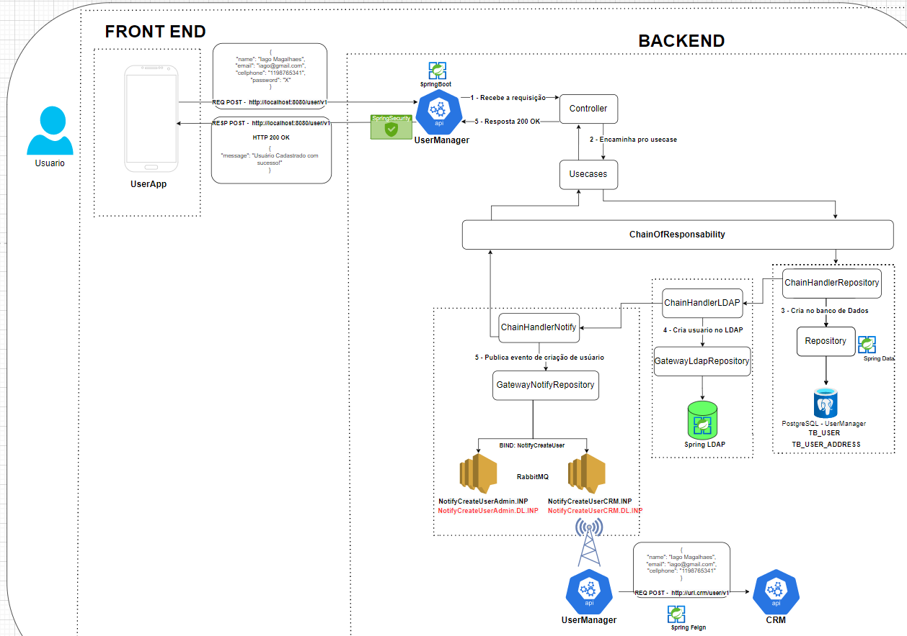

#### Buscando usuários;

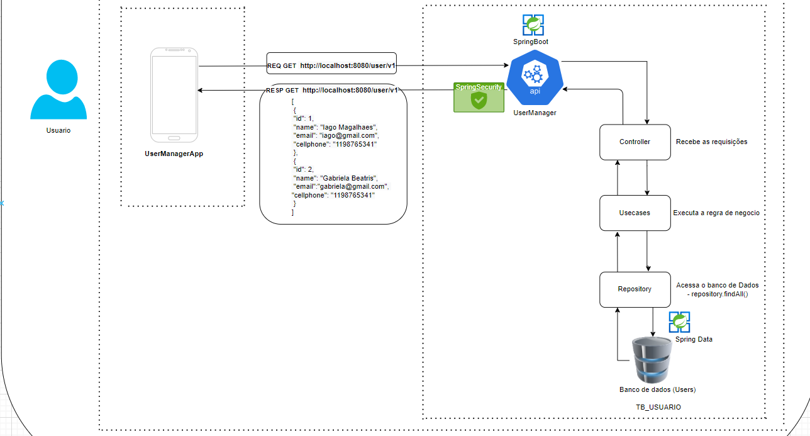

#### Alterando usuário;

#### Deletando usuário;


## Entradas

#### HTTP

    1. Criar usuario                    POST localhost:8080/v1/user        
    2. Buscar usuario                   GET  localhost:8080/v1/user
    3. Alterar dados usuario            PUT  localhost:8080/v1/user
    4. Bloquear / Desbloquear usuario   PUT  localhost:8080/v1/user

#### Fila

    INP: NotifyCreateUserAdmin.INP
    RoutingKey: NotifyCreateUser
    DeadLetter: NotifyCreateUserAdmin.DL.INP
    Routingkey DeadLetter: NotifyCreateUserAdminDL

    INP: NotifyCreateUserCRM.INP
    RoutingKey: NotifyCreateUser
    DeadLetter: NotifyCreateUserCRM.DL.INP
    Routingkey DeadLetter: NotifyCreateUserCRMDL


## Banco de Dados

#### Diagram

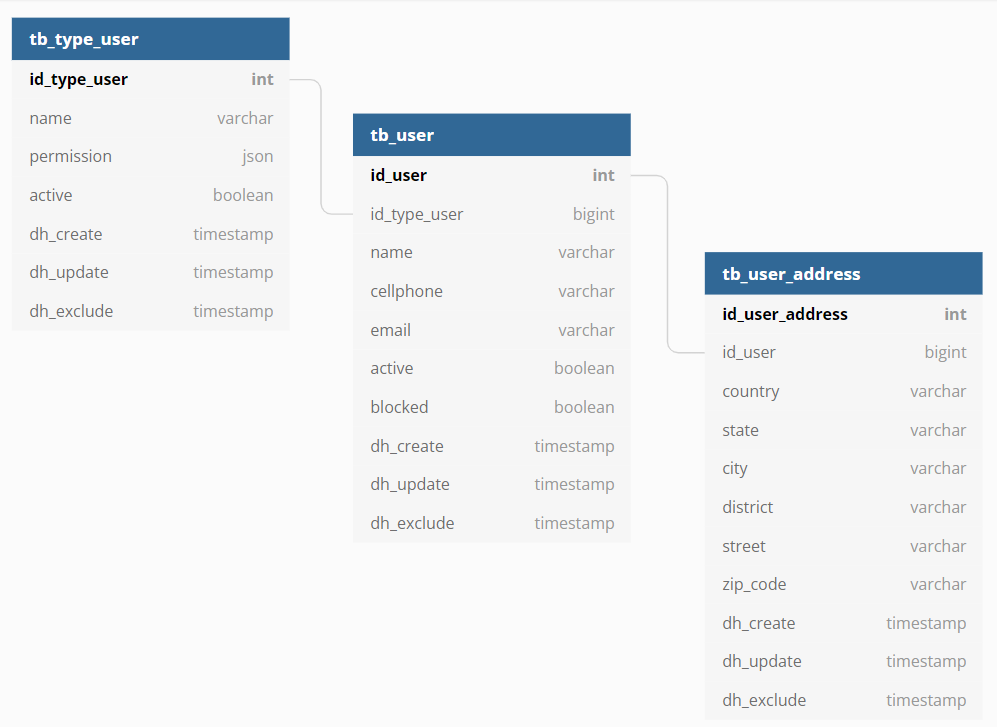

https://dbdiagram.io/d/604fca9cfcdcb6230b244b20


#### Scripts

                    Create database users;			
			--DROP DATABASE users;
			
			grant all privileges on database users to postgres;	

			CREATE TABLE public.tb_type_user(
			id_type_user bigint PRIMARY KEY,
			name varchar(255),
			active boolean,
			dh_create timestamp,
			dh_update timestamp,
			dh_exclude timestamp);
			
			CREATE TABLE public.tb_user(
			id_user bigint PRIMARY KEY,
			name varchar(255),
			id_type_user bigint,
			cellphone varchar(255),
			email varchar(255),
			active boolean,
			blocked boolean,
			dh_create timestamp,
			dh_update timestamp,
			dh_exclude timestamp);

			CREATE TABLE public.tb_user_address(
			id_user_address bigint PRIMARY KEY,
			id_user bigint,
			cellphone varchar(255),
			country varchar(255),
			state varchar(255),
			city varchar(255),
			district varchar(255),
			street varchar(255),
			zip_code varchar(255),
			dh_create timestamp,
			dh_update timestamp,
			dh_exclude timestamp);


## Testes

#### Unitários

    O que é: São testes feitos pelo desenvolvedor para garantir que o que precisa ser feito, está sendo feito
    
    Pra que serve: Manter tudo que está funcionando OK, por ex, se um desenvolvedor mexer em uma regra PARANDO de salvar um registro que deveria ser salvo, o teste unitário irá acusar erro
    
    Conceitos: Tabelas, Sequences
    
    Tecnologias:
    
    Exemplos:
    
    Links: https://www.devmedia.com.br/e-ai-como-voce-testa-seus-codigos/39478


##### Lógica

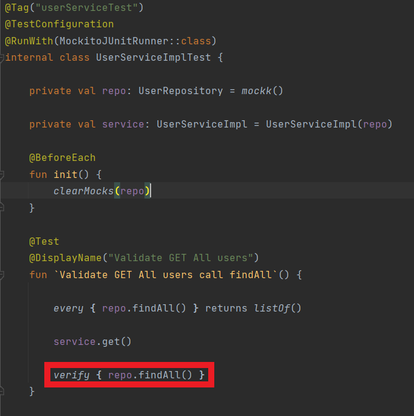

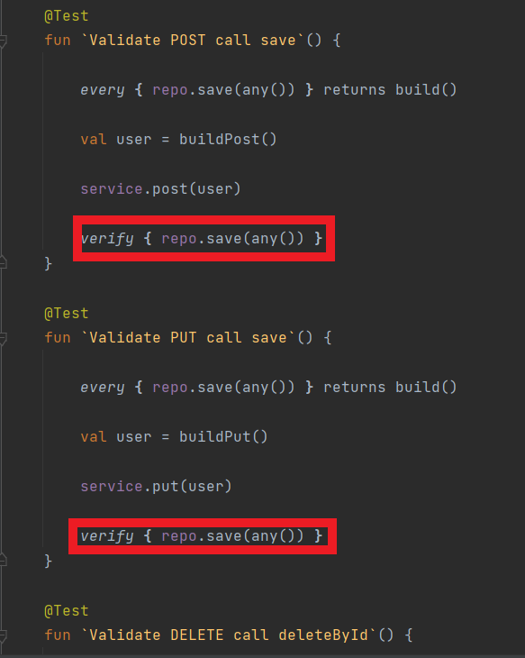


##### Exceção


##### Stratégias

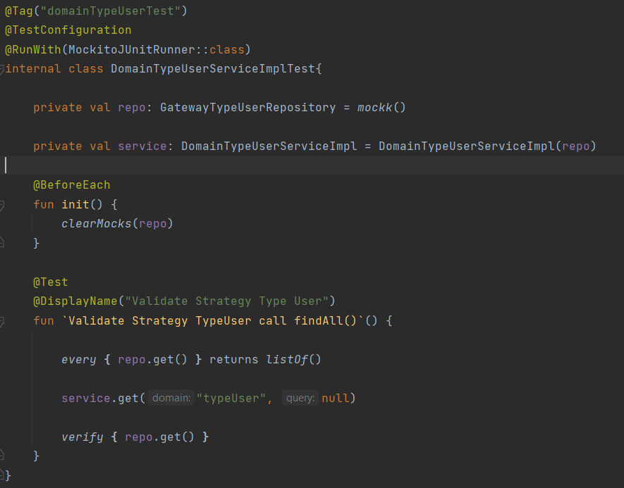


##### Links

- https://resources.jetbrains.com/storage/products/kotlinconf2018/slides/4_Best%20Practices%20for%20Unit%20Testing%20in%20Kotlin.pdf


- https://kotlinlang.org/docs/jvm-test-using-junit.html#what-s-next


- https://www.petrikainulainen.net/programming/testing/running-kotlin-tests-with-gradle/


#### Integrado


##### Lógica

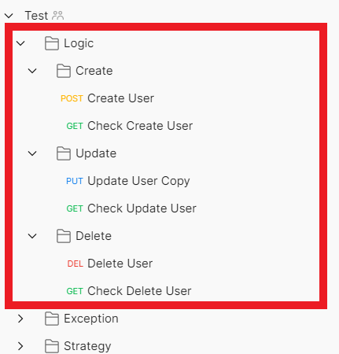


##### Exceção

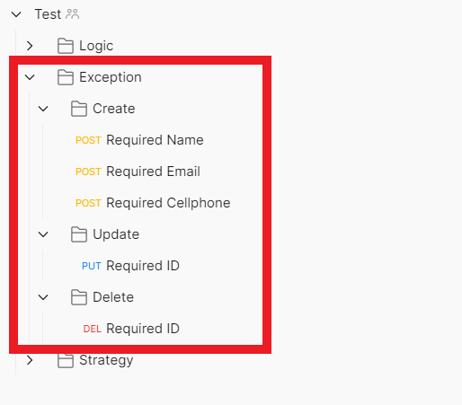

##### Stratégias

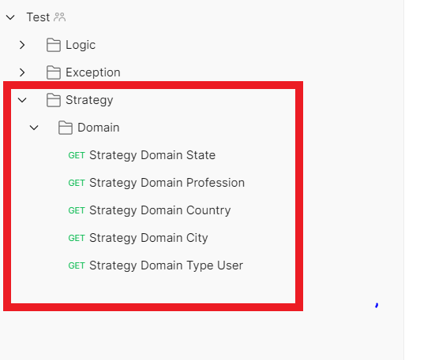

##### Links

- https://learning.postman.com/docs/writing-scripts/script-references/test-examples/


- https://learning.postman.com/docs/writing-scripts/test-scripts/


- https://learning.postman.com/docs/writing-scripts/intro-to-scripts/


# 🛠 Tecnologias

#### Kotlin

- Declarando funções

- Tratando exceção / sucesso

- Extension Function

## Spring Boot

```kotlin
@SpringBootApplication
@EnableWebMvc
@ComponentScan(value = ["com.example.clean.architecture"])
@EntityScan(basePackages = ["com.example.clean.architecture.repository"])
@EnableJpaRepositories(basePackages = ["com.example.clean.architecture.repository"])
class Boot {

	companion object {
		@JvmStatic
		fun main(args: Array<String>) {
			runApplication<Boot>(*args)
		}
	}
}
```
    
    O que é: Framework responsavel por construir o servidor de aplicação onde a REGRA DE NEGOCIO será executada
    
    Pra que serve:  Facilitar o processo de configuração e publicação de aplicações que utilizem o ecossistema Spring.
    
    Conceitos: Injeção de Depêndencias, Bean,
    
    Anotações:
    @SpringBootApplication ->
    @EnableWebMvc ->
    @ComponentScan(value = ["com.example"]) ->
    @EntityScan(basePackages = ["com.example"]) ->
    @EnableJpaRepositories(basePackages = ["com.example"]) ->
    @Configuration  ->
    @Bean ->
    
    Exemplos:
    
    Spring Boot é o framework (tecnologia) que permite construir um servidor de aplicação e
    injetar as dependencias necessárias para execução do serviço.
    
    Ele nos facilita na configuração do servidor, com ele, o desenvolvedor abstrai essa responsabilidade.
    
    Com a evolução do SpringBoot, permitiu-se a evolução da arquitetura de microservicos.
    
    Link:https://blog.geekhunter.com.br/tudo-o-que-voce-precisa-saber-sobre-o-spring-boot/


## Spring Data

### Domain

```kotlin
@Entity
@Table(schema = "public", name = "tb_usuario")
class User (

	@Id
	@GeneratedValue(strategy = GenerationType.AUTO)
	@Column(name = "id_user", nullable = false)
	var id: Long? = null,

	@Column(name = "name")
	val name: String? = null,

	@Column(name = "login")
	val login: String? = null,

	@Column(name = "cellphone")
	val cellphone: String? = null,

	@Column(name = "email")
	val email: String? = null,

	@Column(name = "active")
	val active: Boolean? = null,
	
	@Lob
	@Basic(fetch = FetchType.LAZY)
	@Column(name = "image")
	val image: ByteArray? = null,

	@Column(name = "dh_create")
	val dateCreate: LocalDateTime? = LocalDateTime.now(),

	@Column(name = "dh_update")
	val dateUpdate: LocalDateTime? = null,

	@Column(name = "dh_exclude")
	val dateExclude: LocalDateTime? = null)
```
### Repository
```kotlin
@Repository
interface UserRepository : JpaRepository<User, Long> {

    fun findByNameIn(name: List<String>) : List<User>

    fun findByCellphoneIn(cellphone: List<String>) : List<User>

    fun findByEmailIn(email: List<String>) : List<User>
}
```
### DatabaseConfig

```kotlin
@Configuration
class DataBaseConfig(@Value("\${spring.datasource.postgre.username:postgres}") val user: String,
					 @Value("\${spring.datasource.postgre.password:postgres}") val password: String,
					 @Value("\${spring.datasource.postgre.url:jdbc:postgresql://localhost:5432/users}") val url: String,
					 @Value("\${spring.database.postgre.driverClassName:org.postgresql.Driver}") val driverClassName: String) {

	@Bean
	fun getDataSource(): DataSource? {

		val dataSource = DataSourceBuilder.create()

		dataSource.driverClassName(driverClassName)
		dataSource.url(url)
		dataSource.username(user)
		dataSource.password( password)

		return dataSource.build()
	}
}
```


    O que é: O SpringData é um projeto da SpringSource com proposta de unificar e facilitar o acesso a diferentes tecnologias de armazenamento de dados, como bancos de dados relacionais (PostgreSQL , Oracle) e os NoSQL (DynamoDB, ElasticSource).
    
    Pra que serve: Framework que provê acesso a bases de dados através da JPA.
    
    Conceitos: namedQuery, query, DataSourceConfiguration
    
    Anotações:

    
    @Table ->
    @Entity ->
    @Colunm ->
    @OneToOne ->
    @OneToMany ->
    @Repository ->
    @Query ->
    @Transacional ->
    
    Exemplos:
    Links: https://www.infoq.com/br/articles/spring-data-intro/#:~:text=O%20SpringData%20%C3%A9%20um%20projeto,dados%20relacionais%20e%20os%20NoSQL.
    
    Spring Data é o framework (tecnologia) que gerencia a interface de comunicação com o Banco de Dados e
    todo o relacionamento das entidades (TABELAS)


## Spring Security

### Config
```kotlin
@EnableWebSecurity
@Configuration
open class SecurityConfig(val usecase: SecurityUsecaseImpl) : WebSecurityConfigurerAdapter() {

	@Throws(Exception::class)
	override fun configure(http: HttpSecurity) {
		http
			.httpBasic()
			.and()
			.authorizeRequests()
			.antMatchers("/swagger-ui.html/**").permitAll()
			.antMatchers(HttpMethod.POST, "/user/v1").hasAnyRole("POST_USER", "ADMIN")
			.antMatchers(HttpMethod.GET, "/user/v1").hasAnyRole("GET_ALL_USER", "ADMIN")
			.antMatchers(HttpMethod.PUT, "/user/v1").hasAnyRole("PUT_USER", "ADMIN")
			.antMatchers(HttpMethod.DELETE, "/user/v1").hasAnyRole("DELETE_USER", "ADMIN")
			.antMatchers(HttpMethod.POST, "/landing/page/v1").permitAll()
			.and()
			.csrf().disable()
			.headers().frameOptions().disable()
	}

	@Throws(Exception::class)
	override fun configure(builder: AuthenticationManagerBuilder) {
		builder
			.userDetailsService(usecase)
			.passwordEncoder(BCryptPasswordEncoder())
	}
}
```

### Service

```kotlin
@Service
class SecurityUsecaseImpl(val userUsecase: UserUsecase) : UserDetailsService {

	@Throws(UsernameNotFoundException::class)
	override fun loadUserByUsername(name: String): UserDetails {

		val user = userUsecase.getBy(RequestGetUserEntity(name = name)).first()

		return UserSystemEntity(user.name!!, user.login!!, user.password!!, authorities(user.typeUser))
	}

	private fun authorities(typeUser: TypeUserEntity?) = typeUser?.permission?.map {
					SimpleGrantedAuthority("ROLE_$it")
			}.orEmpty()
}
```


## Spring Feign

### Config

```kotlin
@Configuration
@EnableFeignClients(basePackages = {"com.example.clean.architecture})
class FeignConfig(){}
```

### Client

```kotlin
@FeignClient(value = "crmClient", url = "\${ur.api.crm}")
interface CRMClient{

    @PostMapping("/user/v1")
    fun notifyCreateUser(@RequestBody body: RequestPostNotifyCreateUserCRMEntity)

}
```

    O que é:

    Links: https://docs.spring.io/spring-cloud-openfeign/docs/current/reference/html/
            https://www.baeldung.com/spring-cloud-openfeign


## Spring Actuator

    O que é: Spring Boot Actuator é um subprojeto do Spring Boot Framework. Ele usa pontos de extremidade HTTP para expor informações operacionais sobre qualquer aplicativo em execução.

    Conteúdo completo no link seguinte, dispensa comentários.

    Links: https://springframework.guru/actuator-in-spring-boot/

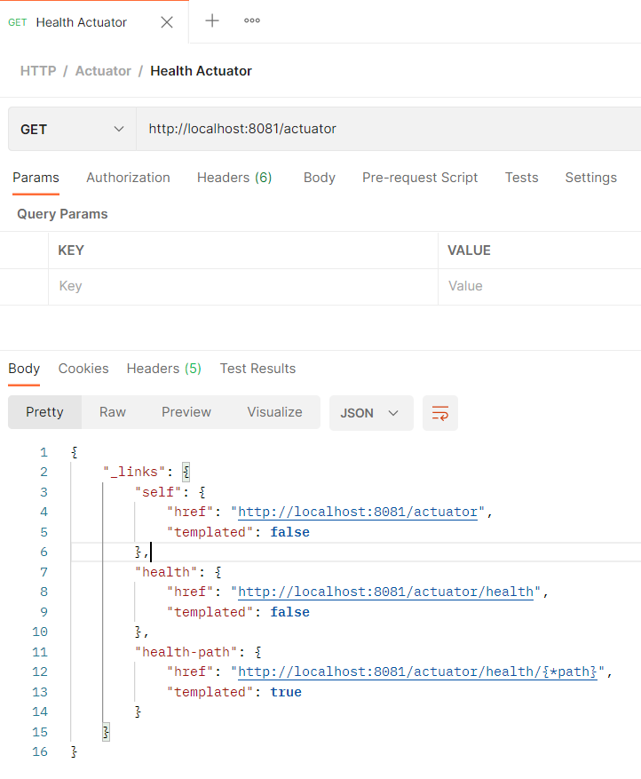

## Spring LDAP

### Domain

```kotlin
@Entry(
	base = "ou=users",
	objectClasses = ["person", "inetOrgPerson", "top"]
)
class LdapUser (

	@Id
	var id: Long? = null,

	@Attribute(name = "cn")
	val name: String? = null,

	@Attribute(name = "cn")
	val password: String? = null
)
```

### Repository

```kotlin
@Repository
interface LdapUserRepository : LdapRepository<LdapUser> {

    fun findByName(name: String?): LdapUser?

    fun findByNameAndPassword(name: String?, password: String?): LdapUser?

    fun findByNameLikeIgnoreCase(name: String?): List<LdapUser>
}
```

### Config

```kotlin
@Configuration
@EnableLdapRepositories(basePackages = ["com.example.clean.architecture.ldapRepository"])
open class LdapConfig()
```


- https://www.baeldung.com/spring-data-ldap

## RabbitMQ

### Config
```kotlin
@Configuration
@EnableRabbit
open class RabbitConfig(@Value("\${rabbit.exchange}") val exchange: String,
                        @Value("\${rabbit.virtualhost}") val virtualHost: String,
                        @Value("\${rabbit.host}") val host: String,
                        @Value("\${rabbit.port}") val port: String,
                        @Value("\${rabbit.username}") val username: String,
                        @Value("\${rabbit.password}") val password: String){

    @Bean
    @Primary
    open fun getConnectionFactory(): ConnectionFactory {

        val factory = CachingConnectionFactory(host, port.toInt())

        factory.virtualHost = virtualHost
        factory.username = username
        factory.setPassword(password)
        factory.rabbitConnectionFactory.isAutomaticRecoveryEnabled = true
        factory.rabbitConnectionFactory.requestedHeartbeat = 15

        return factory
    }
    
    @Bean
    open fun rabbitTemplate(connectionFactory: ConnectionFactory) : RabbitTemplate {
        val template = RabbitTemplate(connectionFactory)

        template.exchange = exchange

        template.messageConverter = producerJacksonMessageConverter()

        return template
    }

    @Bean
    open fun producerJacksonMessageConverter() = Jackson2JsonMessageConverter()

    @Bean
    open fun generalExchange() = TopicExchange(exchange, true, false)

}

```
### Bean Config Create QUEUE

```kotlin
@Configuration
open class QueueNotifyCreateUserAdminConfig(@Value("\${queue.notify.create.user.admin.inp}") val queue: String,
                                            @Value("\${queue.notify.create.user.admin.inp.dl}") val queueDeadletter: String,
                                            @Value("\${rabbit.exchange}" )val exchange: String,
                                            @Value("\${queue.notify.create.user.routing.key}") val routingKey: String,
                                            @Value("\${queue.notify.create.user.admin.routing.key.dl}") val routingKeyDL: String) {

    @Bean
    @Primary
    open fun createQueueNotifyCreateUserAdmin() = QueueBuilder.durable(queue)
            .withArgument("x-dead-letter-exchange", exchange)
            .withArgument("x-dead-letter-routing-key", routingKeyDL)
            .build()

    @Bean
    open fun binding(queue: Queue?, generalExchange: TopicExchange?) =
        BindingBuilder.bind(queue).to(generalExchange).with(routingKey)


    @Bean
    open fun createQueueNotifyCreateUserAdminDeadLetter() =
        QueueBuilder.durable(queueDeadletter).build()

    @Bean
    open fun createQueueNotifyCreateUserAdminDeadLetterBinding(generalExchange: TopicExchange?) =
        BindingBuilder.bind(createQueueNotifyCreateUserDeadLetter()).to(generalExchange).with(routingKeyDL)

}
```

### Listener

```kotlin
@Controller
open class NotifyCreateUserCRMListener(val gatewayNotifyCRMRepository: GatewayNotifyCreateUserCRMRepository) {

    val LOG = LoggerFactory.getLogger(NotifyCreateUserCRMListener::class.java)

	@RabbitListener(queues = ["NotifyCreateUserCRM.INP"])
	fun onMessage(body: RequestPostNotifyCreateUserCRMEntity){

        val method = "NotifyCreateUserCRMListener"

        runCatching {

            LOG.info("START RABBIT $method message: ")

            gatewayNotifyCRMRepository.notifyCRM(body)

        }.onFailure {

            LOG.error("ERROR RABBIT $method  message: ${it.message} localizedMessage: ${it.localizedMessage}" )

            throw it

        }.onSuccess {
            
            LOG.info("END RABBIT $method ")
        }
	}
}
```

### Producer

```kotlin
@Service
open class ProducerNotifyCreateUserUsecaseImpl(val rabbitTemplate: RabbitTemplate) : ProducerNotifyCreateUserUsecase {

	 val LOG = LoggerFactory.getLogger(ProducerNotifyCreateUserUsecaseImpl::class.java)


	override fun produce(body: RequestPostNotifyCreateUserEntity) {

		val methodName = "Produce Notify Create User"

		runCatching {

			LOG.info("START $methodName body: $body")

			rabbitTemplate.send("routingkey", body)

		}.onFailure {

			LOG.error("ERROR $methodName message: {} localizeMessage: {}", it.message, it.localizedMessage)

			throw PostNotifyCreateUserException()

		}.onSuccess {
			LOG.info("END $methodName")

		}
	}
}
```

    O que é: Mensageria é um conceito que define que sistemas distribuídos, possam se comunicar por meio de troca de mensagens (evento), sendo estas mensagens “gerenciadas” por um Message Broker (servidor/módulo de mensagens).”
    
    Pra que serve: Processamento ASSÍNCRONO

    O processamento assíncrono é amplamente utilizado principalmente no sentido de resiliencia e no cenario onde NÃO há RETORNO
    ex: resiliencia: pense em um software que executa a abertura de conta, ele precisa fazer 15 integrações para conseguir abrir a conta... isso tanto pode demorar 2min quanto der erro em alguma dessas etapas.
    
    No fluxo assíncrono com Fila, o usuario faz a solicitação da abertura da conta e no mesmo momento ja recebe um OK, o usuario nao fica aguardando os 2 min, a aplicação se encarrega de AVISAR o usuario quando houver concluido o fluxo.
    ex: sem retorno: Atualização de sessão. não tem retorno, o usuario não precisa aguardar.
    
    Conceitos:
        RoutingKey -> Chave de roteamento para fila
    
        DeadLetter -> Cemitérios de filas mortas. Ex: mensagens que dão exceção por algum motivo, caem na deadletter para serem analisadas/ reprocessadas
    
    Tecnologias: RabbitMQ, Kafka, SQS
    
    Exemplos:
    
    Links: https://rockcontent.com/br/blog/postgresql/
    https://4linux.com.br/o-que-e-postgresql/
    https://www.cloudamqp.com/blog/part4-rabbitmq-for-beginners-exchanges-routing-keys-bindings.html
    
    

#### JUnit

#### Mockito

## PostgreSQL

    O que é: PostgreSQL é um sistema gerenciador de banco de dados objeto-relacional baseado no POSTGRES, Versão 4.2, desenvolvido na Universidade da Califórnia no Departamento de Ciências da Computação em Berkeley, o qual foi pioneiro em muitos conceitos que vieram a estar disponíveis em alguns bancos de dados comerciais mais tarde
    
    Pra que serve: Banco de dados responsavel por armazenar as tabelas, sequences, e todos os registros.
    
    Conceitos: Tabelas, Sequences
    
        SELECT -> Buscar Registro. select * from schema.tb_usuario where documento = '12345678'
    
        UPDATE -> Atualizar Registro. update schema.tb_usuario set telefone = '' where documento = '12345678'
    
        DELETE -: Deletar registro. delete from schema.tb_usuario where documento = '123545768'


    Exemplos:

    Links: https://rockcontent.com/br/blog/postgresql/

           https://4linux.com.br/o-que-e-postgresql/
    
    


# Design Patter'n

#### Clean Architecture

    O que é: Arquitetura Limpa (Clean Architecture) é um padrão arquitetural proposto por Robert Martin – mais conhecido como Uncle Bob – com o objetivo de promover a implementação de sistemas que favorecem reusabilidade de código, coesão, independência de tecnologia e testabilidade. Se quisermos adotar a classificação do Capítulo 7, a Arquitetura Limpa pode ser considerada como uma arquitetura em camadas.
             É um padrão organizicional de projeto que visa o encapsulamento dos repositórios, otimizando a delegação de responsabilidade, reaproveitamento dos modulos entre os microservicos e o isolamento da camada de service para o banco de dados
    
    Pra que serve:
    
    Conceitos: Entidades e Casos de Uso, Adaptadores
    
    Tecnologias:
    
    Exemplos:
    
    Links: https://engsoftmoderna.info/artigos/arquitetura-limpa.html
           
           https://blog.cleancoder.com/uncle-bob/2012/08/13/the-clean-architecture.html


#### Strategy

    O que é: Strategy é um padrão de projeto de software (do inglês design pattern), pode ser chamado de policy. Este padrão foi documentado no Catálogo GOF (Gang of Four), sendo categorizado como um padrão comportamental de desenvolvimento de software.  De modo que delega as responsabilidades adquiridas pelas entidades, atribuindo, portanto, o comportamento. Assim a comunicação entre os objetos é aprimorada, pois há a distribuição das responsabilidades.
    
    Pra que serve: Otimizar soluções
    
    Conceitos:
    
    Tecnologias:
    
    Exemplos:
    
    Links: https://www.devmedia.com.br/estudo-e-aplicacao-do-padrao-de-projeto-strategy/25856
           
    https://pt.wikipedia.org/wiki/Strategy


#### Chain Of Responsability

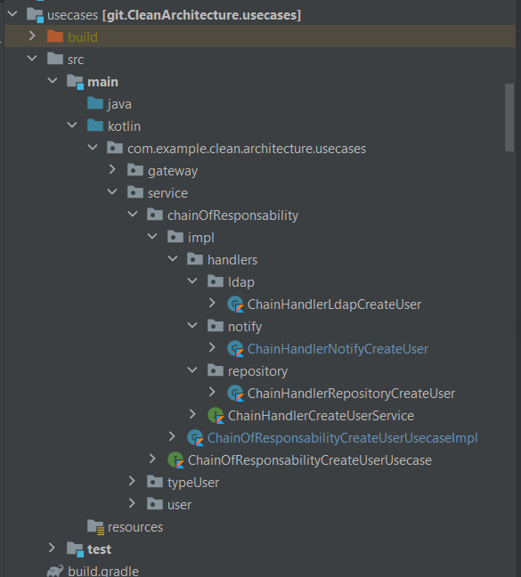

##### Abstract

```kotlin

interface ChainHandlerCreateUserService {

  fun execute(body: RequestPostUserEntity)

  fun next(body: RequestPostUserEntity)

}
```

##### Usecase

```kotlin
@Service
open class ChainOfResponsabilityCreateUserUsecaseImpl(val chainRepository: ChainHandlerRepositoryCreateUser) :
	ChainOfResponsabilityCreateUserUsecase {

	val LOG = LoggerFactory.getLogger(ChainOfResponsabilityCreateUserUsecaseImpl::class.java)

	override fun execute(body: RequestPostUserEntity) {

		val methodName = "ChainOfResponsabilityCreateUser"

		runCatching {

			LOG.info("START $methodName body: $body")

			chainRepository.execute(body)

		}.onFailure {

			LOG.error("ERROR $methodName message: ${it.message} localizedMessage: ${it.localizedMessage}")

			throw it

		}.onSuccess {

			LOG.info("END $methodName")
		}
	}
}

```

##### HandleRepository

```kotlin
@Service
open class ChainHandlerRepositoryCreateUser(val service: UserUsecase, val chainLdap: ChainHandlerLdapCreateUser)
	: ChainHandlerCreateUserService {

	override fun execute(body: RequestPostUserEntity) = service.post(body)
																.also { next(body) }

	override fun next(body: RequestPostUserEntity) = chainLdap.execute(body)
}
```

##### HandleLDAP

```kotlin
@Service
open class ChainHandlerLdapCreateUser(val gatewayLdapUserRepository: GatewayLdapUserRepository,
									  val chainNotify: ChainHandlerNotifyCreateUser
) : ChainHandlerCreateUserService {

	override fun execute(body: RequestPostUserEntity)
			= gatewayLdapUserRepository.post(body.toRequestPostLdapUserEntity())
										 .also { next(body) }

	override fun next(body: RequestPostUserEntity) = chainNotify.execute(body)
}
```

##### HandleNotify

```kotlin
@Service
open class ChainHandlerNotifyCreateUser(val gatewayProducerNotifyCreateUserRepository: GatewayProducerNotifyCreateUserRepository
) : ChainHandlerCreateUserService {

	val LOG = LoggerFactory.getLogger(ChainHandlerNotifyCreateUser::class.java)

	override fun execute(body: RequestPostUserEntity) =
						gatewayProducerNotifyCreateUserRepository.produce(body.toRequestPostNotifyCreateUserEntity())
																	.also { next(body) }

	override fun next(body: RequestPostUserEntity) =
		LOG.info("END Flux ChainOfResponsabilityCreateUser user ${body.name}")

}
```


    O que é: 
    
    Pra que serve: Otimizar soluções
    
    Conceitos:
    
    Tecnologias:
    
    Exemplos:
    
    Links: https://pt.wikipedia.org/wiki/Chain_of_Responsibility


#### Builder


#### Server Driven UI

- https://vitor-ramos.medium.com/entendendo-o-server-driven-ui-adb469add630


#### Estrutura de Packages / Nomeclatura dos arquivos

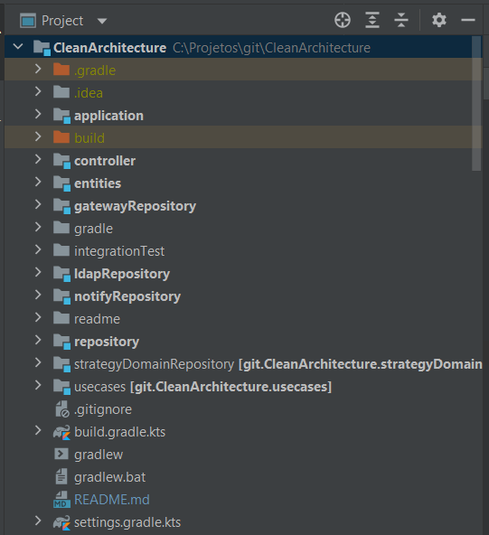

        Entities:
            Domain:
                User -> Objeto pertinente a camada do banco;
                UserEntity -> Objeto para transacionar fora da camada de repositorio;

            DTO:
                Request:
                  RequestNotifieCreateUserEntity -> Objeto de request para integrações
                Response:
                  ResponseNotifieCreateUserEntity -> Objeto de retorno de request para integrações

            Enum:
                TypeUserEnum: -> Referencia de Enum;

            Exception:
                UserPostException: -> Classe de exceção;


        Repository:
            Repository:
                UserRepository -> Interface de comunicação com BD;
            Domain
                User -> Classe de referencia ao BD;
            Config
                DataBaseConfig -> Bean de configuração do BD


        Usecases:
            Service:
                UserService -> Interface;
                UserServiceImpl -> Implementação;          


        Web:
            Controller:
                UserController -> Camada responsável por receber as requisições;
            Config
                SwaggerConfig -> Bean responsavel pela config do Swagger


        GatewayRepository:
            LdapRepository:
                GatewayLdapRepository -> Interface de comunicação entre os módulos

            NotifyRepository:
                GatewayNotifyRepository -> Interface de comunicação entre os módulos

        LdapRepository:
            Gateway:
                GatewayLdapRepositoryImpl -> Implementação do acesso ao módulo do LDAP

            Usecase:
                LdapUsecase -> Interface da camada de negócio
                LdapUsecaseImpl -> Impl da camada de negócio

        NotifyRepository:
            Gateway:
                GatewayNotifyRepositoryImpl -> Implementação do acesso ao módulo do Notify

            Usecase:
                ProducerNotifyCreateUserUsecase -> Interface da camada de negócio
                ProducerNotifyCreateUserUsecaseImpl -> Impl da camada de negócio

            Client:
                CRMClient -> Client de integração com CRM 


#### Padrão de Logs

```kotlin
 val method = "POST User"

runCatching {
  
  LOG.info("START $method user: $document body: $body")

  service.execute();

}.onFailure {
  
  LOG.error("ERROR $method user: $document statusCode: {} cause: {} message: {}",  statusCodeResponse, causeResponse, messageResponse)

  throw it

}.onSucesss {
  LOG.info("END $method user: $document")
}
```

        


#### Clean Code

    O que é: Por que estamos falando tanto sobre código limpo (Clean Code) e por que isto é tão importante para nós? De fato a manutenção de um software é tão importante quanto sua construção.
    
    Como relatado por Robert C. Martin em seu livro clássico, Clean Code, um Best Seller da nossa área, algumas práticas e visões são importantíssimas para mantermos a vida do nosso software.
    
    Pra que serve: As empresas investem milhões em softwares todo ano, mas com tantas mudanças no time e nas tecnologias, como fazer este investimento durar? Como garantir uma boa manutenção, durabilidade, vida ao software? Segundo Uncle Bob, as práticas abaixo são o caminho. Boas praticas para melhorar a manutenção do software
    
    Conceitos:
    
    Exemplos:
    
    Links: https://balta.io/blog/clean-code


#### SOLID

    O que é: Boas praticas na programação.
    
    Pra que serve:
    
    Conceitos:
    
    S.O.L.I.D: Os 5 princípios da POO
    S — Single Responsiblity Principle (Princípio da responsabilidade única)
    O — Open-Closed Principle (Princípio Aberto-Fechado)
    L — Liskov Substitution Principle (Princípio da substituição de Liskov)
    I — Interface Segregation Principle (Princípio da Segregação da Interface)
    D — Dependency Inversion Principle (Princípio da inversão da dependência)
    
    Exemplos:
    Links: https://medium.com/desenvolvendo-com-paixao/o-que-%C3%A9-solid-o-guia-completo-para-voc%C3%AA-entender-os-5-princ%C3%ADpios-da-poo-2b937b3fc530


#### GitFlow

    O que é: Fluxo de trabalho -> Fluxo de gerenciamento de código   PADRÕES

    Pra que serve: Manter uma estrutura de varios desenvolvimentos em paralelo
    
    Conceitos: MASTER , FEATURE , RELEASE, HOTFIX
    
    Exemplos:
    Links: https://www.atlassian.com/br/git/tutorials/comparing-workflows/gitflow-workflow
    
    
    Padrão de gerenciamento de código, boas práticas.


## Readme

- https://docs.github.com/pt/github/writing-on-github/getting-started-with-writing-and-formatting-on-github/basic-writing-and-formatting-syntax

- https://blog.rocketseat.com.br/como-fazer-um-bom-readme/

## Personas

- Robert Martin -> Clean Code && Clean Architecture


## Contact

- https://www.linkedin.com/in/iagomagalh%C3%A3es/


